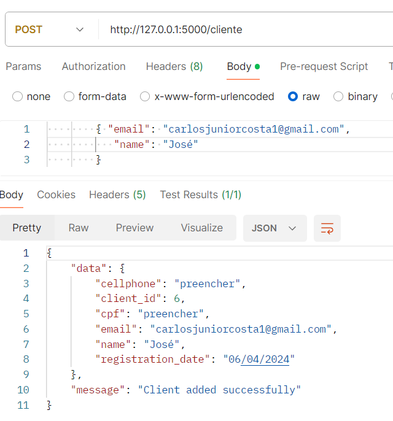
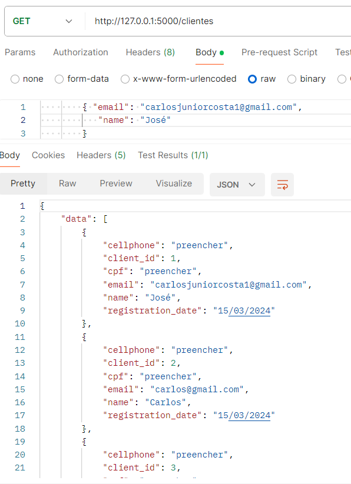
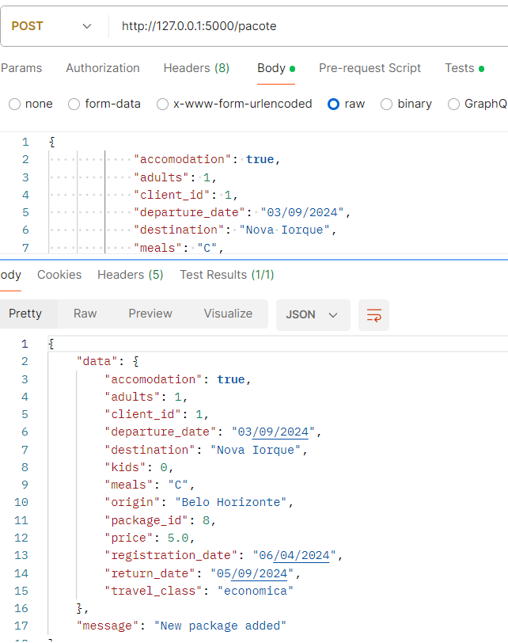

# Plano de Testes de Software
Diante dos cenários apresentados e analisando os requisitos do projeto, foi realizado o plano de teste de software da aplicação. 

|*Caso de Teste      | *CT-001 – Formulário de informações            | 
|------------------|-------------------------------|
| Requisito Associado | RF-001 – A aplicação deve conter o formulário para preenchimento das informações do cliente | 
|Objetivo do Teste| Verificar se se o cliente cadastrado aparece na base de clientes da empresa seguindo os critérios de preenchimento do formulário.| 
|Passos   |1) Acessar a aplicação; 2) Visualizar a tela de “Informações do cliente”; 3) Preencher os campos com as informações solicitadas; 4) Clicar em “Enviar”.| 
| Critério de Êxito| Verificar na aba “Cliente” se o usuário foi adicionado com sucesso.|

|*Caso de Teste      | *CT-002 – Lista de aeroportos            | 
|------------------|-------------------------------|
| Requisito Associado | RF-002 - No campo Destino e Origem o campo deverá retornar uma lista com os aeroportos para cidade desejada pelo cliente. | 
|Objetivo do Teste| Verificar se após a inclusão dos dados nos campos Destino, Origem e Data a aplicação irá retornar os aeroportos mais próximos da cidade desejada.| 
|Passos   |1) Acessar a aplicação; 2) Visualizar a tela de “Destino”; 3) Verificar as opções de aeroportos próximo ao destino escolhido pelo cliente.| 
| Critério de Êxito| Verificar na aba “Destino” se a aplicação retornou as opções de aeroportos mais próximos ao destino do cliente.|

|*Caso de Teste      | *CT-003 – Informações adicionais            | 
|------------------|-------------------------------|
| Requisito Associado |RF-003 – O sistema deverá conter uma checkbox para verificar se o cliente deseja uma viagem com hospedagem, ao selecionar sim ele deve permitir que o cliente selecione se quer algo incluso como café da manha e almoço. | 
|Objetivo do Teste| Verificar se o cliente deseja uma viagem que contemple hospedagem com café da manhã, meia pensão ou pensão completa.| 
|Passos   |1) Acessar a aplicação; 2) Visualizar a tela “Monte o seu pacote de viagem!”; 3) Preencher o campo “Hospedagem?”; 4) Confirmar se deseja ou não hospedagem; 5) Selecionar o tipo de alimentação disponível; 6) Clicar em “Enviar”. | 
| Critério de Êxito| Verificar se as informações selecionadas pelos clientes foram registradas na base de informações do cliente.|

|*Caso de Teste      | *CT-004 – Informações via e-mail ou whatsapp            | 
|------------------|-------------------------------|
| Requisito Associado | RF-004 – A aplicação deve enviar via mensagem no Whatsapp ou Email às informações preenchidas pelo cliente. | 
|Objetivo do Teste| Verificar se houve retorno das informações registradas pelos clientes via Whatsapp ou e-mail.| 
|Passos   |1) Visualizar o email ou whatsapp da empresa; 3) Verificar se o orçamento solicitado pelo cliente encontra-se disponível para consulta.| 
| Critério de Êxito| Verificar se a mensagem estará disponível no e-mail ou Whatsapp da empresa.|

|*Caso de Teste      | *CT-005 – Informações do cliente            | 
|------------------|-------------------------------|
| Requisito Associado | RF-008 – O sistema deve possuir uma tela para que o administrador possa registrar clientes e editar os mesmos | 
|Objetivo do Teste| Verificar os dados dos clientes e realizar possíveis mudanças necessárias.| 
|Passos   |1) Acessar a aplicação; 2) Visualizar a tela “Clientes”; 3) Realizar as modificações necessárias dos clientes; 4) Salvar as informações.| 
| Critério de Êxito| Verificar se as modificações e novos registros foram realizados e salvos na base do administrador. |

|*Caso de Teste      | *CT-006 – Inserção de novo cliente        | 
Requisito associado: |RF-007| Deverá ser desenvolvido uma api para registro dos dados dos clientes e pacotes | ALTA |
|Objetivo do Teste| Verificar se o registro de clientes e está sendo executado corretamente. 
|Passos   |1) Acessar a aplicação; 2) Fazer o payload no Postman, usando o raw json, de acordo com o modelo client; 3) Digitar a url /cliente e selecionar o método POST; 4) Clicar em "send".| 
| Critério de Êxito| Um novo cliente deve ser inserido no banco de dados.|

|*Caso de Teste      | *CT-007 – Listagem de clientes         | 
Requisito associado: |RF-007| Deverá ser desenvolvido uma api para registro dos dados dos clientes e pacotes | ALTA |
|Objetivo do Teste| Verificar a listagem de clientes já inseridos no banco de dados. 
|Passos   |1) Acessar a aplicação; 2) Digitar a url /clientes e selecionar o método GET; 3) Clicar em "send"
| Critério de Êxito| Todos os clientes devem ser listados. |

|*Caso de Teste      | *CT-008 – Inserção de solicitação de novo pacote de viagem       | 
Requisito associado: |RF-007| Deverá ser desenvolvido uma api para registro dos dados dos clientes e pacotes | ALTA |
|Objetivo do Teste| Verificar a inserção de um novo pacote. 
|Passos   |1) Acessar a aplicação; 2) Digitar a url /pacote 3) Montar o payload, em raw json, de acordo com o modelo package e selecionar o método POST; 3) Clicar em "send"
| Critério de Êxito| Uma nova solicitação de pacote deve ser inserida no banco de dados. |

|*Caso de Teste      | *CT-009 – Filtragem de pacotes          | 
Requisito associado: |RF-007| Deverá ser desenvolvido uma api para registro dos dados dos clientes e pacotes | ALTA |
|Objetivo do Teste| Verificar se a filtragem de pacotes por múltiplos critérios está funcionando. 
|Passos   |1) Acessar a aplicação; 2) Digitar a pacotes/filtrar? seguido do critério desejado e selecionar o método GET; 3) Clicar em "send"
| Critério de Êxito| Todos os pacotes que correspondam aos critérios digitados devem ser listados. Os filtros são cumulativos. No caso de strings, são fornecidas todas os valores que possuam parte dos valores digitados, para facilitar a busca (operador %ILIKE%).|
 
# Evidências de Testes de Software

Apresente imagens e/ou vídeos que comprovam que um determinado teste foi executado, e o resultado esperado foi obtido. Normalmente são screenshots de telas, ou vídeos do software em funcionamento. 

## Registro das funcionalidades Front End

| Testes 	| CT-001 – Formulário de Informações |
|:---:	|:---:	|

| Testes 	| CT-002 – Lista de Aeroportos (Origem/Destino)|
|:---:	|:---:	|

| Testes 	| CT-003 – Informações Hospedagem |
|:---:	|:---:	|

| Testes 	| CT-004 – Informações via e-mail ou whatsapp |
|:---:	|:---:	|

## Registro dos erros e soluções Backend (API-Python, Back C#)

# Evidências de Testes de Software - Backend
|*Caso de Teste      | *CT-006 – Inserção de novo cliente        | 

|*Caso de Teste      | *CT-007 – Listagem de clientes         | 

|*Caso de Teste      | *CT-008 – Inserção de solicitação de novo pacote de viagem       | 

|*Caso de Teste      | *CT-009 – Filtragem de pacotes          | 

### C#

| Toast Erro	| Um dos problemas que tivemos na implementação do toast de validação da tela de login é que não estavamos conseguindo fazer ele exibir a mensagem da resposta ao tentar logar |
|:---:	|:---:	|

#### Solução

A solução encontrada para este erro foi colocar uma condição validando se a mensagem for diferente de nulo ele chamar a função pra exibição do erro onde essa função ativa o toast

